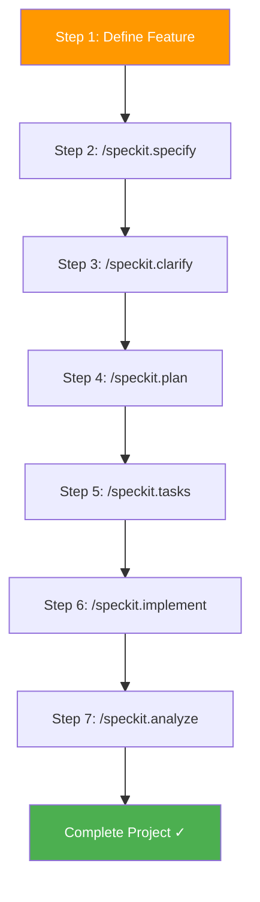

# Demo — Build Azure Cost Monitoring Tool with Spec-kit
{: .no_toc }

This section provides a complete, hands-on demonstration of how to use Spec-kit to build an **Azure Cost Monitoring Tool** from a single natural language description to a fully implemented codebase.
{: .fs-6 .fw-300 }

  
Table of Contents

  {: .text-delta }
- TOC
{:toc}

---

## Demo Overview

In this walkthrough, you will observe the complete Spec-kit pipeline applied to a real-world business case. Each step below mirrors the actual commands and outputs produced during a live demonstration session.

## Business Case

The scenario: Your organization needs an **internal dashboard** to monitor Azure subscription costs, detect spending anomalies, and manage budgets with threshold alerts. The tool must:

- Ingest daily cost data from Azure Consumption API
- Store records in PostgreSQL for historical analysis
- Display interactive charts (daily trends, top contributors, anomalies)
- Support role-based access (Admin, Viewer)
- Enable budget creation with alert thresholds
- Export cost data to CSV for offline analysis
- Deploy on Azure PaaS exclusively (no VMs/AKS)

## What Gets Produced

By the end of this demo, Spec-kit generates:

| Metric | Value |
|---|---|
| Total Tasks | 88 |
| Phases | 8 |
| Source Files | 60+ |
| Lines of Code | ~8,000 |
| Backend | Python + FastAPI + SQLAlchemy |
| Frontend | React + Vite + TypeScript + Recharts |
| Infrastructure | Azure CLI scripts (hub-spoke) |
| Scheduler | Azure Functions (timer trigger) |

## Demo Steps

| Step | Page | What Happens |
|---|---|---|
| 1 | [Define the Feature](/Overview-Github-Spec-kit/demo/step-1-specify/) | Write a natural language description and run `/speckit.specify` |
| 2 | [Clarify Requirements](/Overview-Github-Spec-kit/demo/step-2-clarify/) | Resolve ambiguities with `/speckit.clarify` |
| 3 | [Generate the Plan](/Overview-Github-Spec-kit/demo/step-3-plan/) | Produce architecture, data model, and API contracts |
| 4 | [Create Task List](/Overview-Github-Spec-kit/demo/step-4-tasks/) | Generate 88 dependency-ordered tasks |
| 5 | [Execute Implementation](/Overview-Github-Spec-kit/demo/step-5-implement/) | AI implements all tasks automatically |
| 6 | [Analyze Results](/Overview-Github-Spec-kit/demo/step-6-analyze/) | Validate cross-artifact consistency |

---

{: .tip }
> Follow along by opening VS Code with GitHub Copilot and running each command yourself. The demo uses the exact same inputs shown on each page.
