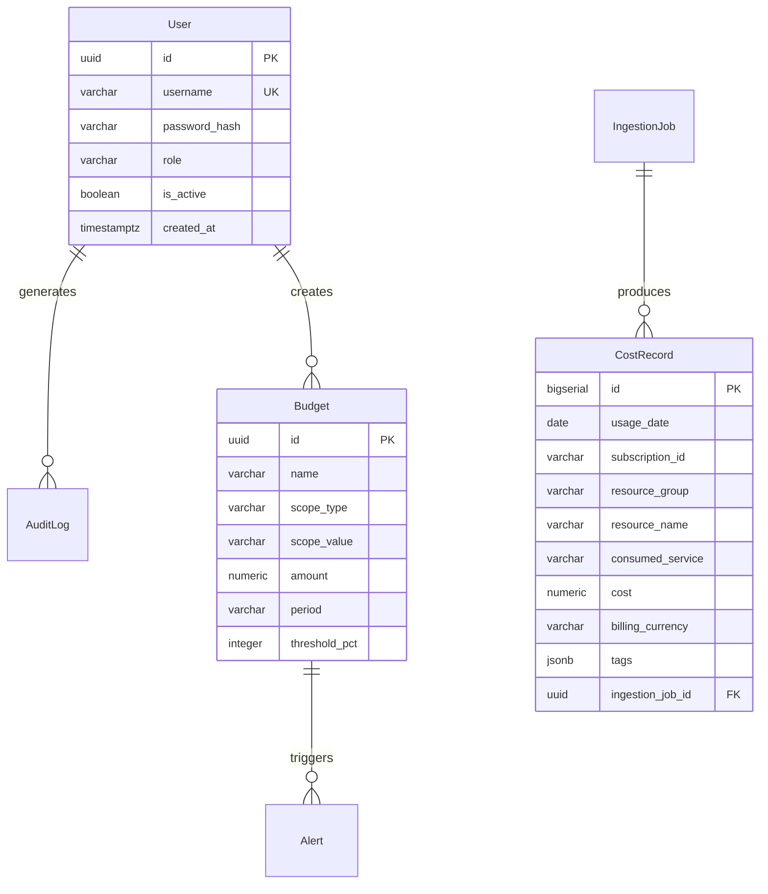

# Step 3 — Generate the Implementation Plan
{: .no_toc }

Produce architecture, data model, API contracts, and project structure from the specification.
{: .fs-6 .fw-300 }

<details open markdown="block">
  <summary>Table of Contents</summary>
  {: .text-delta }
- TOC
{:toc}
</details>

---

## 3.1 Run the Plan Command

```text
/speckit.plan
```

This reads `spec.md` and the project constitution, then generates multiple interrelated design documents.

{: .note }
> The plan command typically takes 2–3 minutes as it generates 5 artifacts simultaneously.

## 3.2 Generated Artifacts

| Artifact | File | Content |
|---|---|---|
| Implementation Plan | `plan.md` | Tech stack, project structure, constitution check |
| Research | `research.md` | Technology decisions with rationale |
| Data Model | `data-model.md` | PostgreSQL schema with ER diagram |
| API Contract | `contracts/openapi.yaml` | Full REST API specification |
| Quickstart | `quickstart.md` | Local development setup guide |

## 3.3 Constitution Validation

The plan validates all project principles before proceeding:

| # | Principle | Status | Evidence |
|---|---|---|---|
| 1 | PaaS-First | ✅ PASS | App Service + Static Web Apps + Functions |
| 2 | Hub-Spoke Networking | ✅ PASS | Hub VNet + Spoke-APP + Spoke-DATA |
| 3 | Azure CLI IaC | ✅ PASS | Scripts in `/infra` (00–05) |
| 4 | Auth Model | ✅ PASS | JWT with bcrypt, pluggable AuthProvider |
| 5 | App Stack | ✅ PASS | FastAPI backend, React + Vite frontend |
| 6 | Observability | ✅ PASS | Application Insights + structured logging |
| 7 | IaC Azure CLI | ✅ PASS | All infra via `az` commands only |
| 8 | Documentation | ✅ PASS | All artifacts generated |

{: .warning }
> If any principle fails, the plan command halts and requires you to either adjust the spec or provide an explicit justification.

## 3.4 Technical Context (Generated)

```markdown
**Language/Version**: Python 3.11 (backend), TypeScript 5.x (frontend)
**Primary Dependencies**: FastAPI, SQLAlchemy + Alembic, azure-identity, 
                         azure-mgmt-consumption, React 18, Vite 5, Recharts
**Storage**: Azure Database for PostgreSQL Flexible Server (v16)
**Testing**: pytest + httpx (backend), Vitest + Testing Library (frontend)
**Target Platform**: App Service Linux, Static Web Apps, Azure Functions
**Performance Goals**: Dashboard <2s, API p95 <500ms, CSV export <10s
```

## 3.5 Project Structure (Generated)

```text
backend/
├── app/
│   ├── main.py              # FastAPI app factory
│   ├── config.py            # Settings (pydantic-settings)
│   ├── models/              # SQLAlchemy ORM models
│   ├── schemas/             # Pydantic request/response schemas
│   ├── api/                 # Route handlers
│   │   ├── auth.py          # Login, refresh, logout
│   │   ├── costs.py         # Dashboard, details, export
│   │   ├── ingestion.py     # Job management
│   │   ├── budgets.py       # Budget CRUD + alerts
│   │   └── admin.py         # Users, audit logs
│   ├── services/            # Business logic layer
│   └── middleware/          # CORS, correlation ID, logging
├── alembic/                 # Database migrations
├── tests/                   # pytest test suite
├── requirements.txt
└── Dockerfile

frontend/
├── src/
│   ├── pages/               # Dashboard, Details, Budgets, Login
│   ├── components/          # Charts, tables, navigation
│   ├── hooks/               # TanStack Query hooks
│   ├── services/api.ts      # HTTP client + interceptors
│   └── store/auth.ts        # Auth state management
├── vite.config.ts
└── package.json

functions/
├── cost_ingestion/          # Timer + HTTP triggers
├── host.json
└── requirements.txt

infra/
├── 00-variables.sh          # Shared naming + CIDRs
├── 01-networking.sh         # Hub-spoke VNets + Firewall
├── 02-data-tier.sh          # PostgreSQL Flexible Server
├── 03-app-tier.sh           # App Service + Static Web Apps
├── 04-functions.sh          # Azure Functions
└── 05-ops-monitoring.sh     # App Insights + alerts
```

## 3.6 Data Model (Generated)

The ER diagram is auto-generated in `data-model.md`:



## 3.7 API Contract Preview

Key endpoints defined in `contracts/openapi.yaml`:

| Method | Endpoint | Purpose |
|---|---|---|
| POST | `/api/v1/auth/login` | Authenticate user |
| POST | `/api/v1/auth/refresh` | Refresh JWT token |
| GET | `/api/v1/costs/summary` | Dashboard summary data |
| GET | `/api/v1/costs/daily-trend` | Trend chart data |
| GET | `/api/v1/costs/by-service` | Cost breakdown by service |
| GET | `/api/v1/costs/details` | Paginated detail table |
| GET | `/api/v1/costs/export` | CSV streaming export |
| POST | `/api/v1/ingestion/jobs` | Trigger manual ingestion |
| GET | `/api/v1/budgets` | List budgets |
| POST | `/api/v1/budgets` | Create budget |

## 3.8 Output Files

```text
specs/001-azure-cost-monitoring/
├── spec.md
├── plan.md              ← NEW
├── research.md          ← NEW
├── data-model.md        ← NEW
├── quickstart.md        ← NEW
└── contracts/
    └── openapi.yaml     ← NEW
```

---

[← Step 2: Clarify](/Overview-Github-Spec-kit/demo/step-2-clarify/) | [Next: Create Task List →](/Overview-Github-Spec-kit/demo/step-4-tasks/)
