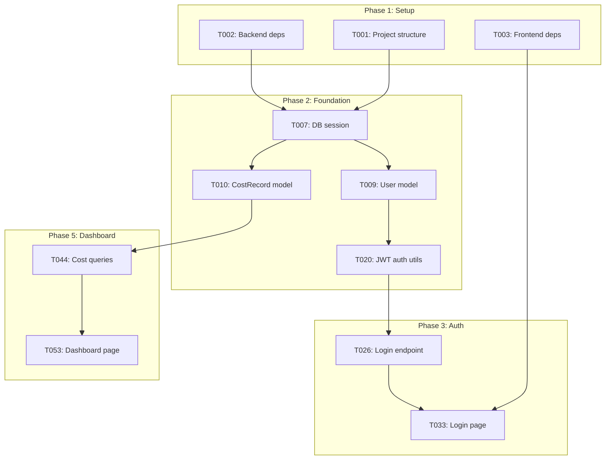

# Step 4 — Generate the Task List
{: .no_toc }

Produce a dependency-ordered, executable task list from the implementation plan.
{: .fs-6 .fw-300 }

<details open markdown="block">
  <summary>Table of Contents</summary>
  {: .text-delta }
- TOC
{:toc}
</details>

---

## 4.1 Run the Tasks Command

```text
/speckit.tasks
```

This reads `plan.md`, `data-model.md`, and `contracts/openapi.yaml` to produce a complete `tasks.md`.

## 4.2 Task Summary

| Metric | Value |
|---|---|
| Total Tasks | 88 |
| Phases | 8 |
| Parallel Groups | 12 |
| User Stories Covered | 6 |
| Files to Create | 60+ |

## 4.3 Phase Breakdown

| Phase | Focus | Tasks | Description |
|---|---|---|---|
| 1 | Setup | T001–T006 | Project structure, dependencies, configs |
| 2 | Foundational | T007–T025 | Database, ORM, middleware, auth utils |
| 3 | Auth (US3) | T026–T035 | Login, JWT, role-based access, admin UI |
| 4 | Ingestion (US2) | T036–T043 | Azure API client, job lifecycle, Functions |
| 5 | Dashboard (US1) | T044–T058 | Cost queries, charts, React pages |
| 6 | Details (US4) | T059–T064 | Paginated table, filters, CSV export |
| 7 | Budgets (US5) | T065–T074 | Budget CRUD, threshold evaluation, alerts |
| 8 | Polish | T075–T088 | Audit logs, infra scripts, Docker, docs |

## 4.4 Task Format

Each task includes:

```markdown
- [ ] T044 [US1] Implement cost summary aggregation query 
      (total, MTD, period comparison) in backend/app/services/cost_service.py
```

| Field | Meaning |
|---|---|
| `T044` | Unique task ID |
| `[US1]` | Linked user story |
| `[P]` | Can run in parallel |
| Description | What to implement |
| File path | Exact target file |

## 4.5 Dependency Resolution

Tasks are ordered to ensure prerequisites are met:



## 4.6 Parallel Execution Groups

Tasks marked `[P]` target different files and can execute concurrently:

```markdown
## Phase 2: Foundational

- [ ] T011 [P] Create IngestionJob ORM model
- [ ] T012 [P] Create Budget ORM model  
- [ ] T013 [P] Create Alert ORM model
- [ ] T014 [P] Create AuditLog ORM model
```

These 4 tasks modify separate files (`models/ingestion_job.py`, `models/budget.py`, etc.) and have no cross-dependencies.

## 4.7 Phase Checkpoints

Each phase ends with a validation checkpoint:

```markdown
**Checkpoint**: Foundation ready — user story implementation can now begin

**Checkpoint**: Auth system operational — users can login, tokens refresh

**Checkpoint**: Cost data flows into PostgreSQL daily

**Checkpoint**: Core MVP complete — dashboard shows live cost data
```

## 4.8 Output

```text
specs/001-azure-cost-monitoring/
├── spec.md
├── plan.md
├── research.md
├── data-model.md
├── quickstart.md
├── contracts/openapi.yaml
└── tasks.md             ← NEW (88 tasks, 8 phases)
```

{: .important }
> The task list is the direct input for `/speckit.implement`. Do not manually reorder tasks unless you understand the dependency chain.

---

[← Step 3: Plan](/Overview-Github-Spec-kit/demo/step-3-plan/) | [Next: Execute Implementation →](/Overview-Github-Spec-kit/demo/step-5-implement/)
