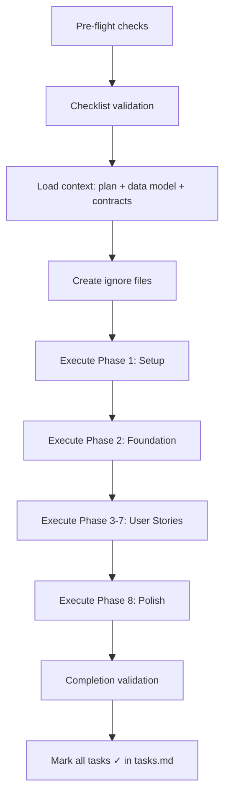

# Step 5 — Execute Implementation
{: .no_toc }

AI executes all 88 tasks automatically, producing the complete project codebase.
{: .fs-6 .fw-300 }

<details open markdown="block">
  <summary>Table of Contents</summary>
  {: .text-delta }
- TOC
{:toc}
</details>

---

## 5.1 Run the Implement Command

```text
/speckit.implement
```

{: .warning }
> This command takes **~30 minutes** for 88 tasks. GitHub Copilot processes each task sequentially (respecting dependencies) and parallel tasks concurrently.

## 5.2 Execution Protocol

The implement command follows a strict protocol:



## 5.3 Live Progress Tracking

As tasks complete, `tasks.md` updates in real-time:

```markdown
- [X] T001 Create project directory structure         ✓ Complete
- [X] T002 [P] Initialize Python project              ✓ Complete  
- [X] T003 [P] Initialize React + Vite project        ✓ Complete
- [X] T004 [P] Create docker-compose.yml              ✓ Complete
- [ ] T007 Create SQLAlchemy base model               ⟳ In progress
- [ ] T008 Initialize Alembic                         ○ Pending
```

## 5.4 What Gets Generated

### Backend (Python + FastAPI)

| Component | Files | Key Functionality |
|---|---|---|
| App Factory | `main.py`, `config.py` | CORS, error handlers, router registration |
| ORM Models | `models/*.py` | User, CostRecord, Budget, Alert, IngestionJob, AuditLog |
| Schemas | `schemas/*.py` | Pydantic validation for all request/response payloads |
| API Routes | `api/*.py` | 15+ REST endpoints per OpenAPI contract |
| Services | `services/*.py` | Auth, cost aggregation, ingestion, budget evaluation |
| Middleware | `middleware/*.py` | Correlation IDs, structured logging, error handling |
| Migrations | `alembic/versions/` | Initial schema migration for all 6 tables |
| CLI | `cli.py` | Admin user seeding command |

### Frontend (React + Vite + TypeScript)

| Component | Files | Key Functionality |
|---|---|---|
| Pages | `pages/*.tsx` | Dashboard, Details, Budgets, Alerts, Login, UserManagement |
| Components | `components/*.tsx` | CostSummaryCard, TrendChart, TopContributors, BudgetCard |
| Hooks | `hooks/*.ts` | TanStack Query hooks for all API endpoints |
| Services | `services/api.ts` | Axios with JWT interceptors + auto-refresh |
| Store | `store/auth.ts` | Token storage, login/logout state management |
| Router | `App.tsx` | Protected routes with role-based guards |

### Infrastructure (Azure CLI)

| Script | Resources Created |
|---|---|
| `00-variables.sh` | Naming conventions, CIDRs, shared variables |
| `01-networking.sh` | Hub VNet, Spoke VNets, Firewall, Route Tables, Peering |
| `02-data-tier.sh` | PostgreSQL Flexible Server (VNet-integrated) |
| `03-app-tier.sh` | App Service Plan, Web App, Static Web App |
| `04-functions.sh` | Function App (Consumption), Storage Account |
| `05-ops-monitoring.sh` | Log Analytics, App Insights, Alert Rules |

### Azure Functions

| Trigger | Function | Schedule |
|---|---|---|
| Timer | `cost_ingestion` | Daily at 06:00 UTC |
| HTTP | `manual_refresh` | On-demand via admin API |

## 5.5 Sample Generated Code

### Backend — Cost Service (excerpt)

```python
# backend/app/services/cost_service.py

async def get_cost_summary(
    db: AsyncSession,
    start_date: date,
    end_date: date,
    subscription_id: str | None = None,
    resource_group: str | None = None,
) -> CostSummaryResponse:
    """Aggregate costs for dashboard summary card."""
    query = select(
        func.sum(CostRecord.cost).label("total_cost"),
        func.count(CostRecord.id).label("record_count"),
    ).where(
        CostRecord.usage_date.between(start_date, end_date)
    )
    if subscription_id:
        query = query.where(CostRecord.subscription_id == subscription_id)
    if resource_group:
        query = query.where(CostRecord.resource_group == resource_group)
    
    result = await db.execute(query)
    row = result.one()
    return CostSummaryResponse(total=row.total_cost, records=row.record_count)
```

### Frontend — Dashboard Page (excerpt)

```tsx
// frontend/src/pages/Dashboard.tsx

export function Dashboard() {
  const { data: summary, isLoading } = useCostSummary(filters);
  const { data: trend } = useDailyTrend(filters);
  const { data: topServices } = useCostByService(filters);

  return (
    <div className="dashboard-grid">
      <CostSummaryCard data={summary} loading={isLoading} />
      <TrendChart data={trend} />
      <TopContributors data={topServices} />
    </div>
  );
}
```

### Infrastructure — Networking (excerpt)

```bash
#!/usr/bin/env bash
# infra/01-networking.sh

# Hub VNet
az network vnet create \
  --resource-group "$RG_NAME" \
  --name "$VNET_HUB" \
  --address-prefix "10.0.0.0/16" \
  --subnet-name AzureFirewallSubnet \
  --subnet-prefix "10.0.1.0/24"

# Spoke-APP VNet
az network vnet create \
  --resource-group "$RG_NAME" \
  --name "$VNET_SPOKE_APP" \
  --address-prefix "10.1.0.0/16" \
  --subnet-name app-subnet \
  --subnet-prefix "10.1.1.0/24"
```

## 5.6 Final Task Completion

After all 88 tasks complete:

```bash
$ grep -c "\[X\]" specs/001-azure-cost-monitoring/tasks.md
88
```

All tasks marked `[X]` — implementation complete.

---

[← Step 4: Tasks](/Overview-Github-Spec-kit/demo/step-4-tasks/) | [Next: Analyze Results →](/Overview-Github-Spec-kit/demo/step-6-analyze/)
