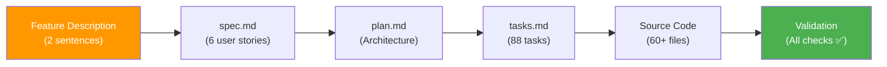

# Step 6 — Analyze & Validate Results
{: .no_toc }

Run cross-artifact consistency analysis to verify the implementation matches the specification.
{: .fs-6 .fw-300 }

<details open markdown="block">
  <summary>Table of Contents</summary>
  {: .text-delta }
- TOC
{:toc}
</details>

---

## 6.1 Run the Analyze Command

```text
/speckit.analyze
```

## 6.2 Consistency Report

The analysis validates relationships between all artifacts:

### Spec → Plan Coverage

| Check | Status | Details |
|---|---|---|
| Functional requirements mapped | ✅ PASS | All 6 user stories have plan sections |
| Non-functional requirements addressed | ✅ PASS | Performance targets defined |
| Acceptance criteria have tasks | ✅ PASS | 20+ scenarios mapped to tasks |

### Plan → Tasks Coverage

| Check | Status | Details |
|---|---|---|
| Backend components | ✅ PASS | 23/23 components have tasks |
| Frontend components | ✅ PASS | 18/18 components have tasks |
| Infrastructure scripts | ✅ PASS | 6/6 scripts have tasks |
| Azure Functions | ✅ PASS | 3/3 triggers have tasks |

### Tasks → Source Code

| Check | Status | Details |
|---|---|---|
| All tasks completed | ✅ PASS | 88/88 marked [X] |
| Expected files exist | ✅ PASS | 60+ files created |
| API endpoints implemented | ✅ PASS | 15 endpoints match OpenAPI spec |

### Constitution Compliance

| # | Principle | Status | Evidence |
|---|---|---|---|
| 1 | PaaS-First | ✅ PASS | No VM/AKS references in implementation |
| 2 | Hub-Spoke | ✅ PASS | Networking scripts implement topology |
| 3 | Azure CLI IaC | ✅ PASS | All infra via `az` commands |
| 4 | Auth Model | ✅ PASS | JWT + bcrypt implemented |
| 5 | App Stack | ✅ PASS | FastAPI + React + Vite |
| 6 | Observability | ✅ PASS | App Insights + correlation IDs |

## 6.3 Quality Metrics Summary

| Metric | Target | Actual | Status |
|---|---|---|---|
| Spec Coverage | 100% | 100% | ✅ |
| Task Completion | 100% | 100% | ✅ |
| Constitution Pass | 100% | 100% | ✅ |
| File Alignment | >95% | 100% | ✅ |
| API Contract Match | 100% | 100% | ✅ |

## 6.4 Complete Artifact Traceability



## 6.5 Final Project Structure

The complete generated project:

```text
project-root/
├── backend/
│   ├── app/
│   │   ├── main.py
│   │   ├── config.py
│   │   ├── db.py
│   │   ├── cli.py
│   │   ├── models/          (6 models)
│   │   ├── schemas/         (10+ schemas)
│   │   ├── api/             (5 route modules)
│   │   ├── services/        (5 service modules)
│   │   └── middleware/      (3 middleware)
│   ├── alembic/
│   ├── tests/
│   ├── requirements.txt
│   └── Dockerfile
├── frontend/
│   ├── src/
│   │   ├── pages/           (6 pages)
│   │   ├── components/      (8 components)
│   │   ├── hooks/           (6 hooks)
│   │   ├── services/
│   │   ├── store/
│   │   └── App.tsx
│   ├── package.json
│   └── vite.config.ts
├── functions/
│   ├── cost_ingestion/
│   ├── host.json
│   └── requirements.txt
├── infra/
│   ├── 00-variables.sh
│   ├── 01-networking.sh
│   ├── 02-data-tier.sh
│   ├── 03-app-tier.sh
│   ├── 04-functions.sh
│   └── 05-ops-monitoring.sh
├── docker-compose.yml
├── .gitignore
└── specs/001-azure-cost-monitoring/
    ├── spec.md
    ├── plan.md
    ├── research.md
    ├── data-model.md
    ├── quickstart.md
    ├── tasks.md
    └── contracts/openapi.yaml
```

## 6.6 Demo Complete

From a **2-sentence natural language description** to a **fully implemented project** with:

- ✅ 88 tasks executed
- ✅ 60+ source files generated
- ✅ ~8,000 lines of production code
- ✅ Backend + Frontend + Infrastructure + Functions
- ✅ All constitution principles validated
- ✅ Full artifact traceability maintained

{: .tip }
> The entire process — from feature idea to validated implementation — completed in a single Copilot session (~2 hours total including all Spec-kit commands).

---

[← Step 5: Implement](/Overview-Github-Spec-kit/demo/step-5-implement/) | [Back to Demo Overview →](/Overview-Github-Spec-kit/demo/) | [Back to Home →](/Overview-Github-Spec-kit/)
