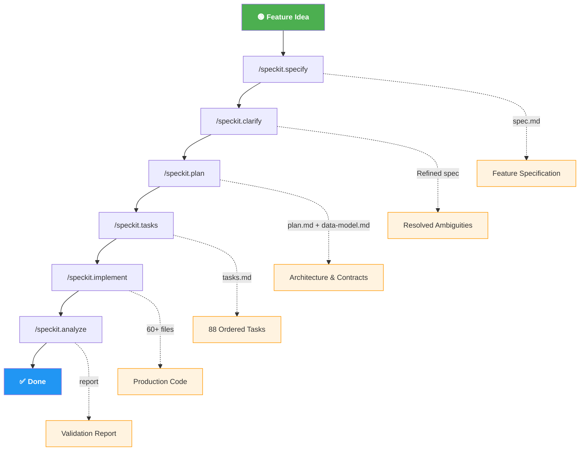

# Overview GitHub Spec-kit — Workshop
{: .fs-9 }

Accelerate software development with **AI-powered specification and implementation** using GitHub Copilot Spec-kit — a structured workflow that transforms natural language feature descriptions into production-ready code.
{: .fs-6 .fw-300 }

[Get Started](/Overview-Github-Spec-kit/modules/01-prerequisites/){: .btn .btn-primary .fs-5 .mb-4 .mb-md-0 .mr-2 }
[View Workflow](/Overview-Github-Spec-kit/modules/02-speckit-overview/){: .btn .fs-5 .mb-4 .mb-md-0 }

---

## What You'll Build

A complete **Azure Cost Monitoring Tool** using the Spec-kit workflow, demonstrating:

- **Feature Specification** — Transform a natural language description into a structured spec
- **Automated Planning** — Generate architecture, data models, API contracts, and implementation plans
- **Task Decomposition** — Break down complex features into dependency-ordered, executable tasks
- **AI-Powered Implementation** — Execute all 88 tasks automatically with GitHub Copilot
- **Quality Analysis** — Validate consistency across all generated artifacts

---

## Spec-kit Workflow

The following diagram illustrates the end-to-end Spec-kit pipeline — from a natural language feature idea through to validated production code:

| Stage | Command | Output Artifact |
|---|---|---|
| Specify | `/speckit.specify` | Feature specification (`spec.md`) |
| Clarify | `/speckit.clarify` | Refined spec with resolved ambiguities |
| Plan | `/speckit.plan` | Architecture, data model, API contracts |
| Tasks | `/speckit.tasks` | Dependency-ordered task list (`tasks.md`) |
| Implement | `/speckit.implement` | Production code for all tasks |
| Analyze | `/speckit.analyze` | Cross-artifact consistency report |

---

## Architecture at a Glance

| Component | Technology | Azure Resource |
|---|---|---|
| 🖥️ Frontend | React + Vite + TypeScript | Static Web Apps |
| ⚙️ Backend | Python + FastAPI | App Service Linux |
| 🗄️ Database | PostgreSQL 16 | Flexible Server (VNet) |
| ⏱️ Scheduler | Azure Functions (Timer) | Consumption Plan |
| 🔐 Secrets | Key Vault | Standard |
| 🌐 Networking | Hub-Spoke VNet | Azure Firewall |
| 📊 Monitoring | Application Insights | Log Analytics |

---

## Workshop Modules

| # | Module | Duration | Description |
|---|---|---|---|
| 1 | [Prerequisites](/Overview-Github-Spec-kit/modules/01-prerequisites/) | 10 min | Set up your environment |
| 2 | [Spec-kit Overview](/Overview-Github-Spec-kit/modules/02-speckit-overview/) | 15 min | Understand the workflow |
| 3 | [Specification](/Overview-Github-Spec-kit/modules/03-specification/) | 20 min | Create a feature spec |
| 4 | [Planning](/Overview-Github-Spec-kit/modules/04-planning/) | 20 min | Generate the implementation plan |
| 5 | [Task Generation](/Overview-Github-Spec-kit/modules/05-task-generation/) | 15 min | Produce executable task list |
| 6 | [Implementation](/Overview-Github-Spec-kit/modules/06-implementation/) | 30 min | Execute all tasks with AI |
| 7 | [Analysis & Review](/Overview-Github-Spec-kit/modules/07-analysis-review/) | 10 min | Validate and iterate |

**Total estimated time: ~2 hours**
{: .fs-5 .fw-300 }

## Key Design Decisions

- **Structured over ad-hoc** — Spec-kit enforces a repeatable specification → plan → tasks → implement pipeline
- **GitHub Copilot Agent Mode** — Leverages VS Code agent capabilities for multi-file code generation
- **Artifact traceability** — Every implementation decision traces back to spec requirements
- **Constitution governance** — Project-wide principles enforced across all generated artifacts
- **PaaS-first architecture** — Demo project uses Azure managed services exclusively (no VMs/AKS)

---

{: .note }
> This workshop uses the **Azure Cost Monitoring Tool** as a demonstration project. The Spec-kit workflow itself is technology-agnostic and can be applied to any software project.
