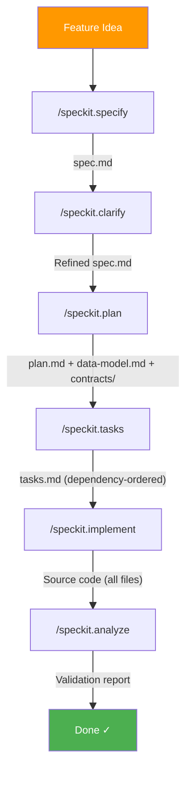

# Module 2 — Spec-kit Overview
{: .no_toc }

Understand the Spec-kit workflow, its components, and how it transforms natural language descriptions into production-ready code.
{: .fs-6 .fw-300 }

<details open markdown="block">
  <summary>Table of Contents</summary>
  {: .text-delta }
- TOC
{:toc}
</details>

---

## 2.1 What is Spec-kit?

Spec-kit is a **structured AI-powered workflow** for GitHub Copilot that bridges the gap between a feature idea and its complete implementation. It provides a repeatable pipeline of commands that generate progressively more detailed artifacts — from high-level specification through to executable code.

| Stage | Command | Output |
|---|---|---|
| Specify | `/speckit.specify` | Feature specification (`spec.md`) |
| Clarify | `/speckit.clarify` | Refined spec with answered questions |
| Plan | `/speckit.plan` | Architecture, data model, API contracts |
| Tasks | `/speckit.tasks` | Dependency-ordered task list (`tasks.md`) |
| Implement | `/speckit.implement` | Production code for all tasks |
| Analyze | `/speckit.analyze` | Consistency validation report |

## 2.2 Workflow Pipeline

The Spec-kit workflow follows a linear progression with feedback loops:



## 2.3 Traditional Vibe Coding vs. Spec-kit

| Aspect | Traditional Vibe Coding | GitHub Spec-kit |
|---|---|---|
| **Approach** | Ad-hoc prompting, trial and error | Structured 6-stage pipeline |
| **Planning** | Minimal — start coding immediately | Architecture, data model, API contracts generated first |
| **Consistency** | Results vary with each prompt | Repeatable, governed by constitution |
| **Traceability** | No link between requirements and code | Every line traces to a specification requirement |
| **Governance** | None — no guardrails | Constitution enforces principles automatically |
| **Scalability** | Works for small scripts (~100 lines) | Handles 88+ tasks, 60+ files, 8,000+ lines |
| **Quality assurance** | Manual review only | Automated cross-artifact consistency analysis |
| **Architecture drift** | Common — design degrades over time | Prevented — plan validates against constitution |
| **Documentation** | Written after the fact (if at all) | Generated as a byproduct of the workflow |
| **Collaboration** | Hard to share context between sessions | Spec artifacts persist and can be resumed |
| **Error handling** | Fix issues as they appear | Dependencies resolved before implementation starts |
| **Refactoring** | Frequent rework due to poor planning | Minimal — architecture decided upfront |

{: .tip }
> Vibe coding is great for quick prototypes and experiments. Spec-kit is designed for **production-quality projects** where consistency, traceability, and governance matter.

## 2.4 Artifact Structure

All Spec-kit artifacts are stored in a `specs/` directory within your project:

```text
specs/001-feature-name/
├── spec.md              # Feature specification
├── plan.md              # Implementation plan
├── research.md          # Technology decisions
├── data-model.md        # Database schema
├── quickstart.md        # Setup guide
├── contracts/
│   └── openapi.yaml     # API contract
├── tasks.md             # Executable task list
└── checklists/          # Quality checklists (optional)
    ├── ux.md
    ├── test.md
    └── security.md
```

## 2.5 Constitution

The **constitution** is a project-wide governance document (`.specify/memory/constitution.md`) that defines architectural principles enforced across all Spec-kit commands. Examples include:

- Technology stack requirements (e.g., "PaaS-first, no VMs")
- Authentication model (e.g., "JWT with refresh tokens")
- Infrastructure approach (e.g., "Azure CLI only, no Bicep/Terraform")
- Networking topology (e.g., "Hub-spoke VNet architecture")

{: .important }
> The constitution is checked at the start of every Spec-kit command. Violations halt execution and require explicit justification.

## 2.6 Git Integration

Spec-kit includes optional Git workflow commands:

| Command | Purpose |
|---|---|
| `/speckit.git.initialize` | Initialize a Git repository |
| `/speckit.git.feature` | Create a numbered feature branch |
| `/speckit.git.commit` | Auto-commit after each Spec-kit step |
| `/speckit.git.validate` | Validate branch naming conventions |

## 2.7 Key Benefits

| Benefit | Description |
|---|---|
| **Repeatability** | Same workflow produces consistent, high-quality output |
| **Traceability** | Every line of code traces back to a specification requirement |
| **Governance** | Constitution enforces project-wide architectural decisions |
| **Speed** | 88 implementation tasks executed in a single session |
| **Quality** | Cross-artifact consistency validated automatically |
| **Documentation** | Spec, plan, and contracts generated as byproducts |

## Checklist

Before proceeding to Module 3:

- ☐ Understand the 6-stage Spec-kit pipeline
- ☐ Know the artifact structure (`specs/` directory)
- ☐ Understand the role of the constitution
- ☐ Familiar with Git integration commands

---

[← Prerequisites](/Overview-Github-Spec-kit/modules/01-prerequisites/) | [Next: Constitution →](/Overview-Github-Spec-kit/modules/03-constitution/)
