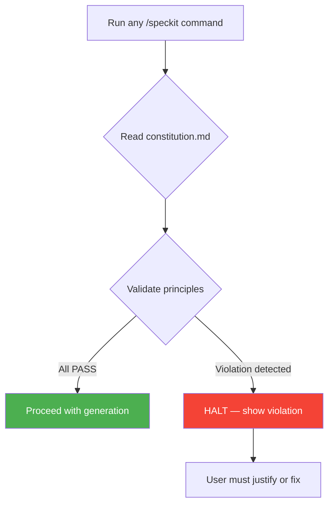

# Module 3 — Project Constitution
{: .no_toc }

Define project-wide governance principles that Spec-kit enforces across every generated artifact.
{: .fs-6 .fw-300 }

<details open markdown="block">
  <summary>Table of Contents</summary>
  {: .text-delta }
- TOC
{:toc}
</details>

---

## 3.1 What is the Constitution?

The **constitution** is a governance document that establishes architectural principles, technology constraints, and design rules for your project. Spec-kit reads this document before every command and validates that all generated artifacts comply with its principles.

{: .important }
> The constitution must be created **before** running `/speckit.specify`. It acts as a guardrail — preventing Spec-kit from generating plans or code that violate your project's foundational decisions.

## 3.2 Create the Constitution

Run the following command in VS Code Copilot Chat:

```text
/speckit.constitution
```

Spec-kit will ask you a series of questions to establish your project's principles. For the Azure Cost Monitoring Tool, we answer:

| # | Question | Answer |
|---|---|---|
| 1 | Target platform? | Azure PaaS only (no VMs, no AKS) |
| 2 | Infrastructure as Code approach? | Azure CLI scripts only (no Bicep/Terraform) |
| 3 | Networking topology? | Hub-spoke VNet architecture |
| 4 | Application stack? | Python + FastAPI backend, React + Vite frontend |
| 5 | Authentication model? | Static login with JWT (bcrypt hashing) |
| 6 | Database? | PostgreSQL Flexible Server (VNet-integrated) |
| 7 | Observability? | Application Insights + structured logging |
| 8 | Documentation standard? | All design artifacts auto-generated by Spec-kit |

## 3.3 Generated Constitution

The command produces `.specify/memory/constitution.md`:

```markdown
# Project Constitution

## Principles

### 1. PaaS-First Deployment
All workloads MUST run on Azure PaaS services. Virtual Machines and 
Azure Kubernetes Service are explicitly prohibited.

### 2. Hub-Spoke Networking
Network topology MUST follow hub-spoke pattern with Azure Firewall 
in the hub and application/data workloads in dedicated spokes.

### 3. Azure CLI Infrastructure
All infrastructure provisioning MUST use Azure CLI (`az`) commands. 
Bicep, ARM templates, and Terraform are not permitted.

### 4. Application Stack
- Backend: Python 3.11+ with FastAPI
- Frontend: React 18+ with Vite and TypeScript
- Database: PostgreSQL 16 via Azure Flexible Server

### 5. Authentication Model
Static credential login with bcrypt password hashing and JWT tokens 
(1-hour access, 7-day refresh). No Azure AD/SSO integration.

### 6. Observability
Application Insights for telemetry. Structured JSON logging with 
correlation IDs propagated across all service boundaries.

### 7. Documentation
All architecture, data model, and API documentation generated as 
Spec-kit artifacts. No manual documentation required.
```

## 3.4 How Spec-kit Enforces the Constitution

Every subsequent Spec-kit command validates against the constitution:



### Example Violation

If during planning Spec-kit detects that a proposed architecture uses AKS:

```text
❌ CONSTITUTION VIOLATION

Principle: PaaS-First Deployment
Evidence: Plan proposes AKS cluster for backend deployment
Required: Azure App Service or Container Apps only

Action: Revise plan to use PaaS service, or provide explicit 
justification to override this principle.
```

## 3.5 Constitution Validation Table

During the `/speckit.plan` step, a compliance table is generated:

| # | Principle | Status | Evidence |
|---|---|---|---|
| 1 | PaaS-First | ✅ PASS | App Service + Static Web Apps + Functions |
| 2 | Hub-Spoke Networking | ✅ PASS | Hub VNet + Spoke-APP + Spoke-DATA |
| 3 | Azure CLI IaC | ✅ PASS | Scripts in `/infra` (00–05) |
| 4 | App Stack | ✅ PASS | FastAPI backend, React + Vite frontend |
| 5 | Auth Model | ✅ PASS | JWT with bcrypt, pluggable AuthProvider |
| 6 | Observability | ✅ PASS | Application Insights + structured logging |
| 7 | Documentation | ✅ PASS | All artifacts generated |

## 3.6 File Location

```text
.specify/
└── memory/
    └── constitution.md    ← Project governance document
```

{: .tip }
> You can update the constitution at any time by running `/speckit.constitution` again. Changes are reflected in all subsequent Spec-kit commands.

## 3.7 Why Constitution First?

| Without Constitution | With Constitution |
|---|---|
| Each command makes independent assumptions | Consistent decisions across all artifacts |
| Architecture may drift between plan and code | Plan and code validated against same principles |
| Technology choices scattered across spec | Single source of truth for all constraints |
| No enforcement mechanism | Automatic violation detection |

## Checklist

Before proceeding to Module 4:

- ☐ Created project constitution with `/speckit.constitution`
- ☐ Verified all principles are captured
- ☐ Understand how violations are detected and reported
- ☐ File located at `.specify/memory/constitution.md`

---

[← Spec-kit Overview](/Overview-Github-Spec-kit/modules/02-speckit-overview/) | [Next: Specification →](/Overview-Github-Spec-kit/modules/04-specification/)
